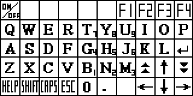

## 项目目标
请基于这份 [LavaX语言的描述文档](./LavaX-docs.md) 和 [lav文件的描述文档](./lav-format.md)，帮我做一个基于网页的，LavaX编译器、虚拟机运行器、反编译器。
1. 支持类似c语言的LavaX源码的编辑、语法高亮、编译
2. 可以先编译成类似汇编的中间码，就是将类似C的源码编译成方便转成lav字节码的中间码
3. 再将中间码编译成lav文件
4. 实现虚拟机运行lav文件
5. 类似的，可以将lav文件反编译成中间码和c源码

LavaX主要是执行在文曲星早期电子词典上。文曲星硬件大概是160x80的黑白点阵屏。
虚拟机需要实现：
1. 文曲星点阵屏的模拟显示
2. 文曲星文件系统的实现，所有文件和字符串编码
3. 实现文曲星的软键盘绘制
4. 文曲星的字体有两种16x16的点阵字体，和12x12的点阵字体